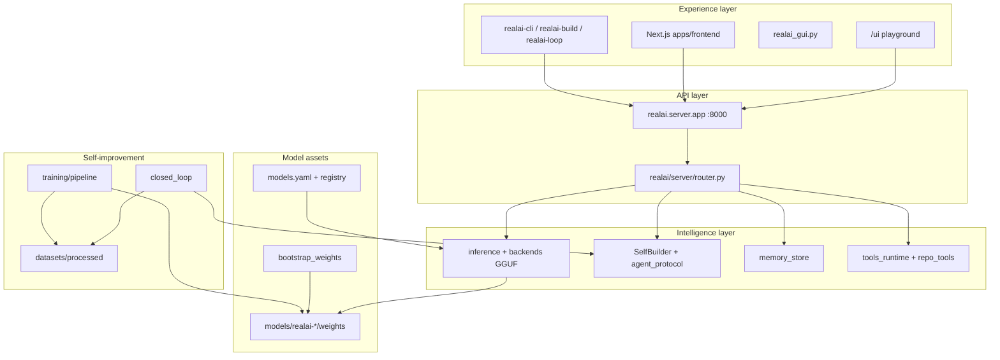

# RealAI — Full Command Reference & Architecture Layers

**Purpose:** One document that explains how RealAI is layered, what to install, what to run, and how the pieces connect so everything works locally (no cloud keys required for the core loop).

**Repo root:** clone `https://github.com/Unwrenchable/realai` and work from that directory.

---

## Table of contents

1. [Architecture layers (top → bottom)](#1-architecture-layers-top--bottom)
2. [First-time setup](#2-first-time-setup)
3. [Environment variables](#3-environment-variables)
4. [Configuration files](#4-configuration-files)
5. [Installed CLI entry points](#5-installed-cli-entry-points)
6. [Commands by workflow](#6-commands-by-workflow)
7. [HTTP API & Web UIs](#7-http-api--web-uis)
8. [Training & native weights pipeline](#8-training--native-weights-pipeline)
9. [Self-build & closed loop](#9-self-build--closed-loop)
10. [Frontend & monorepo (Node)](#10-frontend--monorepo-node)
11. [Tests & diagnostics](#11-tests--diagnostics)
12. [Troubleshooting](#12-troubleshooting)
13. [Legacy / alternate entry points](#13-legacy--alternate-entry-points)

---

## 1. Architecture layers (top → bottom)

RealAI is not a single binary. Think of it as stacked layers. **The primary runtime today is `realai/server/`** (structured Python backend). Other folders are SDKs, training, alternate UIs, or future/target-state modules.



### Layer cheat sheet

| Layer | Location | What it does |
| --- | --- | --- |
| **Experience** | `playground.py`, `apps/frontend`, `realai_gui.py`, CLIs | Chat, self-build buttons, tasks UI |
| **API** | `realai/server/app.py`, `router.py` | `/v1/*`, `/health`, `/ui`, streaming chat |
| **Inference** | `realai/server/backends.py`, `inference.py` | Loads GGUF, runs chat completions |
| **Agents** | `self_builder.py`, `agent_protocol.py` | TOOL/DONE protocol, repo edits |
| **Repo tools** | `repo_tools.py` | `read_file`, `grep`, `search_replace`, `run_terminal_command` |
| **Memory & tasks** | memory store, router handlers | Summaries, `/v1/tasks`, SQLite |
| **Tools manifest** | `tools_runtime` | file, web3 Solana/EVM, etc. |
| **Model assets** | `model_assets.py`, `models/` | GGUF paths, `weights_ready` |
| **Training** | `realai/training/*` | Ingest → finetune → publish GGUF |
| **Closed loop** | `closed_loop.py` | Server → self-build → ingest → datasets |
| **Providers (optional)** | `providers.yaml` | Cloud adapters; disabled by default locally |

---

## 2. First-time setup

### 2.1 Prerequisites

- **Python 3.12+**
- **Git**
- Optional: **Node 20+** and **pnpm** (for `apps/frontend`)
- Optional: **llama.cpp** or **llama-cpp-python** for GGUF inference
- Optional: GPU + `requirements-training.txt` for finetune

### 2.2 Python install

```bash
cd realai
python -m venv .venv
```

**Linux / macOS / WSL:**

```bash
source .venv/bin/activate
pip install -r requirements.txt
pip install -e .
```

**Windows (PowerShell):**

```powershell
.\.venv\Scripts\Activate.ps1
pip install -r requirements.txt
pip install -e .
```

### 2.3 Config

```bash
cp realai.toml.example realai.toml
```

The in-repo `realai.toml` already targets local native mode (`default_chat_model = "realai-1.0-instruct"`, `[native] auto_bootstrap`).

### 2.4 GGUF weights

Place a `.gguf` under `models/`, for example:

- `models/Llama-3.2-1B-Instruct-Q4_K_M.gguf`
- `models/qwen2.5-coder-7b-instruct-q5_k_m.gguf` (better for coding)

Brand as RealAI native:

```bash
python -m realai.training.bootstrap_weights
```

### 2.5 Client URL

```bash
export REALAI_API_URL=http://127.0.0.1:8000
```

Windows: `$env:REALAI_API_URL = "http://127.0.0.1:8000"`

### 2.6 Minimal verification

**Terminal A:**

```bash
python -m realai.server.app
```

**Terminal B:**

```bash
curl -s http://127.0.0.1:8000/health
curl -s http://127.0.0.1:8000/v1/models
```

Browser: **http://127.0.0.1:8000/ui**

---

## 3. Environment variables

| Variable | Default | Purpose |
| --- | --- | --- |
| `REALAI_API_URL` | `http://127.0.0.1:8000` | CLI, SelfBuilder, closed loop |
| `REALAI_WORKSPACE` | repo root | Repo tool read/write root |
| `REALAI_WEIGHTS_ROOT` | `models/` in repo | Override GGUF search |
| `REALAI_BOOTSTRAP_GGUF` | toml / defaults | Bootstrap source GGUF |
| `REALAI_BASE_HF_MODEL` | `Qwen/Qwen2.5-1.5B-Instruct` | HF base for finetune |
| `REALAI_SELF_IMPROVE` | unset | `1` / `true` for mutating self-improve APIs |
| `HF_TOKEN` | — | HF auth / faster downloads |
| `HF_HUB_ENABLE_HF_TRANSFER` | — | `1` for faster HF downloads |
| `XAI_API_KEY` | — | Only if cloud providers enabled |

---

## 4. Configuration files

| File | Role |
| --- | --- |
| `realai.toml` | Server, `[native]`, `[self_builder]`, backends |
| `realai.toml.example` | Template |
| `models.yaml` | Model registry |
| `providers.yaml` | External providers |
| `models/models/registry.json` | Per-model metadata (`model_registry_path`) |

---

## 5. Installed CLI entry points

After `pip install -e .`:

| Command | Description |
| --- | --- |
| `realai-server` | Start server on :8000 |
| `realai-build` | One self-build task |
| `realai-loop` | Full closed loop |
| `realai-cli` | `chat`, `health`, `models`, `providers`, `tasks`, `build` |

Module equivalents:

```bash
python -m realai.server.app
python -m realai.self_builder "task"
python -m realai.closed_loop
python -m realai.training.pipeline --stage status
```

---

## 6. Commands by workflow

### Run server

```bash
python -m realai.server.app
```

### Chat CLI

```bash
realai-cli chat "Hello" --model realai-1.0-instruct
realai-cli health
realai-cli models
```

### Self-build (one task)

```bash
realai-build "Add a unit test for agent_protocol"
python -m realai.self_builder "your task" --max-steps 16
realai-cli build "your task"
```

### Closed loop

```bash
export REALAI_SELF_IMPROVE=1
realai-loop
realai-loop --check-only
realai-loop --iterations 3 --task "Run unittest and fix failures"
realai-loop --no-auto-confirm
```

Windows: `start_self_build.bat` or `start_self_build.bat "task text"`

### Training pipeline

```bash
python -m realai.training.pipeline --stage status
python -m realai.training.pipeline --stage ingest
python -m realai.training.pipeline --stage datasets
python -m realai.training.pipeline --stage finetune --max-steps 100
python -m realai.training.pipeline --stage export
python -m realai.training.pipeline --stage eval --server http://127.0.0.1:8000
python -m realai.training.pipeline --stage bootstrap
python -m realai.training.pipeline --stage all
```

Before finetune:

```bash
pip install -r requirements-training.txt
```

After export: **stop server**, then restart `python -m realai.server.app`.

### Helpers

```bash
python scripts/setup_local_llama.py
python -m benchmarks.runner
docker compose up
```

---

## 7. HTTP API & Web UIs

**Base:** `http://127.0.0.1:8000`

| Method | Path | Purpose |
| --- | --- | --- |
| GET | `/health` | Health |
| GET | `/metrics` | Prometheus |
| GET | `/ui` | Playground |
| GET | `/v1/models` | Models + `weights_ready` |
| POST | `/v1/chat/completions` | Chat (`stream: true` = SSE) |
| POST | `/v1/embeddings` | Embeddings |
| GET | `/v1/tools` | Tools |
| POST | `/v1/memory/*` | Store / inspect / clear |
| POST/GET | `/v1/tasks` | Orchestration |
| POST | `/v1/agent/selfbuild` | SelfBuilder step |

**OpenAI client:**

```python
from openai import OpenAI
client = OpenAI(base_url="http://127.0.0.1:8000/v1", api_key="local")
```

**Next frontend:** `pnpm install && pnpm dev` (port 3000, proxies to backend).

---

## 8. Training & native weights pipeline

```
traces → self_builder_sessions.jsonl → ingest → train/val.jsonl
  → finetune (HF merged) → export (GGUF) → server
```

Layout:

```
models/realai-1.0-instruct/weights/*.gguf
```

See [REALAI_NATIVE_MODEL.md](REALAI_NATIVE_MODEL.md).

---

## 9. Self-build & closed loop

**Repo tools:** `read_file`, `list_dir`, `grep`, `search_replace`, `run_terminal_command`.

`realai-loop` phases: server check → self-build → ingest → datasets → weight status.

See [SELF_BUILD_LOCAL.md](SELF_BUILD_LOCAL.md).

---

## 10. Frontend & monorepo (Node)

| Command | Purpose |
| --- | --- |
| `pnpm install` | Workspace deps |
| `pnpm dev` | Next dev |
| `pnpm build` | Build packages |

---

## 11. Tests & diagnostics

```bash
python -m unittest tests.test_self_builder tests.test_agent_protocol tests.test_extract_sessions -q
python -m unittest discover -s tests -q
realai-loop --check-only
python -m realai.training.pipeline --stage status
```

---

## 12. Troubleshooting

| Symptom | Fix |
| --- | --- |
| No chat models | Start server; run `bootstrap_weights` |
| MISSING weights in UI | Add `.gguf`; bootstrap; restart |
| WinError 1224 on export | Stop server first |
| Finetune no merged | `requirements-training.txt`; data in `train.jsonl` |
| HF 401 gated | `REALAI_BASE_HF_MODEL=Qwen/Qwen2.5-1.5B-Instruct` or HF login |
| `/ui` JS undefined | Hard refresh; restart server |

---

## 13. Legacy entry points

Prefer `python -m realai.server.app` for native local mode.

| Entry | Notes |
| --- | --- |
| `realai/api_server.py` | Older server + `/v1/agents/*` |
| `realai_gui.py` | Desktop GUI |
| `realai_local_server.py` | Helper server |
| `apps/api/main.py` | Alternate API layout |

---

## Quick reference card

```text
pip install -r requirements.txt && pip install -e .
python -m realai.training.bootstrap_weights
export REALAI_API_URL=http://127.0.0.1:8000
python -m realai.server.app          # → /ui
export REALAI_SELF_IMPROVE=1 && realai-loop
pip install -r requirements-training.txt
python -m realai.training.pipeline --stage finetune --max-steps 100
# stop server, then export + restart
```

### Fully automatic improvement loop

```powershell
$env:REALAI_SELF_IMPROVE = "1"
$env:REALAI_API_URL = "http://127.0.0.1:8000"
python -m realai.auto_improver --min-examples 150 --min-success-rate 0.25 --manage-server
```

This script keeps collecting traces, then when it decides the model "has enough learning ability" (data volume + recent success rate), it will:

- Stop the server
- Run finetune + export + bootstrap
- Restart the server with the new weights
- Raise the bar and repeat

See `realai/auto_improver.py` for all options (`--once`, different thresholds, etc.).
```

**Related:** [INDEX.md](INDEX.md) · [SELF_BUILD_LOCAL.md](SELF_BUILD_LOCAL.md) · [REALAI_NATIVE_MODEL.md](REALAI_NATIVE_MODEL.md) · [QUICKSTART_LOCAL.md](../QUICKSTART_LOCAL.md)