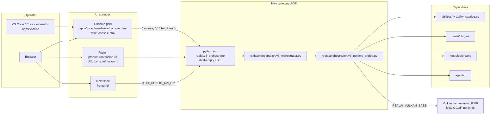

# Monorepo target layout — Unwrenchable/RealAi

**Status:** plan only. This document does not move, delete, or rewrite product code.
**Branch authority:** `live/realai-clean-20260911`
**Product home:** `C:\RealAI-clean` (`REALAI_HOME` / `REALAI_PRODUCT_ROOT` / `REALAI_WORKSPACE`)
**Python package:** `C:\RealAI-clean\realai` (`import realai`)

When this file and an older map disagree about *where gold lives*, [`AUTHORITY.md`](AUTHORITY.md) and [`ARCHITECTURE.md`](../ARCHITECTURE.md) win. The inventory below is a classification of the tree as it exists on this branch (snapshot 2026-09-26), using [`REALAI_PACKAGE_MAP.md`](REALAI_PACKAGE_MAP.md), [`APPS_MAP.md`](APPS_MAP.md), [`TARGET_LAYOUT.md`](TARGET_LAYOUT.md), and [`REORG_PHASES.md`](REORG_PHASES.md).

Physical moves, if any, are sequenced in [`MONOREPO_MIGRATION_PHASES.md`](MONOREPO_MIGRATION_PHASES.md). Each later phase is its own PR. This PR is the contract.

---

## Hard rules (do not renegotiate in a move PR)

| Rule | Path |
|------|------|
| One product tree | `C:\RealAI-clean`. No second git repo under `realai/`. No `v1/` or `v2/` directories. |
| Hive gold | `realai/orchestration/v3_orchestrator.py` (160,075 bytes on this snapshot) |
| Bridge gold | `realai/orchestration/v3_runtime_bridge.py` (91,468 bytes) |
| Fusion | Product-root `fusion-ui/` |
| Console gold | `apps/vscode/webview/console.html`, byte-synced to root `console.html` |
| Plugins | `realai/plugins` |
| Organs | `modules/organs` |
| Dest-empty shims | Keep. They re-export gold and contain no second engine. |
| Dumps | `_quarantine/`, `recovered/`, `imports/`, `recovery/*` branches, `C:\RealAI-gold`, `C:\RealAI-clean-backup`, and unified/`main` dumps stay libraries. Never mega-merge them onto live. |

Launchers and Craft keep importing the shims:

```python
import realai.v3_orchestrator       # shim → realai.orchestration.v3_orchestrator
import realai.v3_runtime_bridge     # shim → realai.orchestration.v3_runtime_bridge
import realai.plugins               # plugin authority
from modules.organs import hive_status
```

`python -m realai.v3_orchestrator --host 127.0.0.1 --port 8001` stays the hive front door.

---

## Why the hive does not move under `packages/`

The phrase "packages/realai-core" describes a **logical** package (the Python hive), not a directory move.

| Name already on disk | What it actually is |
|----------------------|---------------------|
| `realai/` | The Python package. `pyproject.toml` (`version = "3.0.0"`) finds `realai*`. Every launcher imports it. |
| `packages/core/` | An empty npm package whose `package.json` `name` is `realai-core` (noop lint/build scripts, one file). It is not the hive. |
| `realai/realai-core/` | Was a nested dump inside the Python package (224 KB). Parked at `_quarantine/twins_20260926/realai__realai-core/`. Not a workspace member. |

Moving hive gold into `packages/realai-core/` would break `import realai`, the setuptools `include` list, and the gold paths above. Short-term and long-term, hive source stays at `realai/`. The empty npm stub keeps its current name until a later JS-only tidy, and it never receives Python.

Console gold stays inside the VS Code extension (`apps/vscode/webview/console.html`). A `packages/console` extract is not part of this layout: the extension and `:8001/console` both serve that file's twin at the repo root.

---

## Two workspaces, one tree

The repo is already a monorepo. The sprawl is three front doors sharing one root, not a missing `packages/` folder.

| Front door | Contract file | Members |
|------------|---------------|---------|
| Python hive | `pyproject.toml` | `realai`, `abilities`, `modules`, `agents`, `agent_tools`, root `core` (shim), root `plugins` (shim) |
| JS / UI workspace | `pnpm-workspace.yaml` | `apps/*`, `packages/*`, `providers/*`, `models/*`, `frontend` |
| Foreign overlay | root `package.json` (`name`: `app-builder-workspace`) | `src/`, `vite.config.ts`, root `startup.sh` — Grok App Builder scaffold, not the hive |

Edit the door that owns the concern. Do not add a fourth root (`v4/`, `unified/`, another `realai/`).

---

## Target tree

Short-term, every gold path below is already in this place. The tree is the target, with noise called out so later phases can park it. Indentation is the mental map, not a move script.

```
C:\RealAI-clean\                         # REALAI_HOME — one product
│
├─ README.md  ARCHITECTURE.md  ABILITIES.md  ANY_REPO.md
├─ pyproject.toml                        # Python workspace
├─ pnpm-workspace.yaml                   # JS workspace
├─ realai.toml  models.yaml  providers.yaml
│
├─ realai\                               # logical package: realai-core (Python)
│   ├─ orchestration\
│   │   ├─ v3_orchestrator.py            # HIVE GOLD
│   │   └─ v3_runtime_bridge.py          # BRIDGE GOLD
│   ├─ v3_orchestrator.py                # SHIM (dest-empty re-export)
│   ├─ v3_runtime_bridge.py              # SHIM (dest-empty re-export)
│   ├─ hive.py                           # public hive surface
│   ├─ ability_catalog.py                # honesty map
│   ├─ plugins\                          # PLUGIN GOLD
│   ├─ core\                             # self_builder / self_heal / closed_loop gold
│   ├─ cli\  server\  voice\  bot\  learn\
│   └─ agent_tools_gold\
│
├─ abilities\                            # ability handlers (product root)
├─ agents\                               # manifests Hive loads
├─ modules\
│   ├─ organs\                           # ORGANS GOLD
│   └─ orchestrators\                    # realai-worker entry
│
├─ apps\
│   ├─ vscode\                           # Console extension (realai-vscode 1.2.15)
│   │   └─ webview\console.html          # CONSOLE GOLD
│   ├─ api\                              # local ASGI helpers
│   └─ dashboard\                        # @realai/dashboard stub
├─ console.html                          # served twin of console gold (must match bytes)
├─ fusion-ui\                            # FUSION GOLD (static HTML; hive redirects UX)
├─ frontend\                             # Next shell (realai-frontend)
│
├─ packages\                             # JS/TS only
│   ├─ design-system\                    # @realai/design-system
│   ├─ sdk-ts\  sdk-py\  realai-sdk\  cli\  ui\
│   └─ core\                             # empty npm name realai-core — not the hive
│
├─ providers\  models\                   # pnpm members; weights stay off git
├─ docs\                                 # this plan lives here
├─ scripts\  scanners\  tests\
│
├─ _quarantine\                          # in-repo shelf of parked twins (do not absorb)
├─ recovered\  imports\                  # archaeology pointers
│
└─ (external shelves, not this git tree)
    C:\RealAI-gold
    C:\RealAI-clean-backup
    D:\RealAI-archive\_quarantine
```

Weights stay outside git: `C:\llama-vulkan\models`, `C:\models`, `D:\models`.

---

## What lives where

| Concern | Edit here | Leave alone |
|---------|-----------|-------------|
| Hive HTTP, tools, multi-agent | `realai/orchestration/v3_orchestrator.py` | `realai/v3_orchestrator.py` (shim) |
| Runtime bridge (orch ↔ Vulkan, tools, agents) | `realai/orchestration/v3_runtime_bridge.py` | `realai/v3_runtime_bridge.py` (shim) |
| Plugins, RackUp coach | `realai/plugins/` | root `plugins/` (compat re-export) |
| Ability handlers | product-root `abilities/` | `realai/abilities/` (authority note only) |
| Honesty map | `realai/ability_catalog.py` | quarantine copies of the same basename |
| Organs | `modules/organs/` | `realai/modules/organs/` (park note; body already in `_quarantine`) |
| Self-build / closed loop | `realai/core/` | root `core/` (re-export) and package-root `self_*.py` shims |
| Console UI | `apps/vscode/webview/console.html`, then sync to root `console.html` | `realai/apps/vscode/` (incomplete nest) |
| Fusion static assets | product-root `fusion-ui/` | `apps/fusion-ui/`, `realai/fusion-ui/` |
| Next shell | `frontend/` | `apps/frontend/` (slim parked twin), `_quarantine/twins_20260926/realai__realai-frontend/` |
| UI tokens | `packages/design-system/` | ad-hoc CSS at repo root |
| Worker loop | `modules/orchestrators/` (`realai-worker`) | `_quarantine/twins_20260926/realai__orchestrator-default-run/` |
| Docs for humans | `docs/` plus root `ARCHITECTURE.md` | `realai/docs/` historical copies |
| Promote tools | `scanners/` | not on the runtime import path |

New runtime code goes in `realai/<pillar>/` (orchestration, core, plugins, voice, training). A new ability is `abilities/<name>.py` plus a catalog row. A new plugin is `realai/plugins/<name>/`. New operator UI goes in `frontend/` or `apps/vscode/`.

---

## What stays put short-term

No path in the gold table moves in the phase that lands this document.

Stays exactly where it is until a later phase says otherwise, and even then only by `git mv` plus a dest-empty shim:

- `realai/orchestration/v3_orchestrator.py`
- `realai/orchestration/v3_runtime_bridge.py`
- `realai/v3_orchestrator.py` and `realai/v3_runtime_bridge.py`
- `realai/plugins/`
- `modules/organs/`
- `abilities/`
- `agents/`
- `apps/vscode/` including `webview/console.html`
- root `console.html` (sync target)
- product-root `fusion-ui/`
- `frontend/`
- `packages/design-system/`
- `_quarantine/`, `recovered/`, `imports/`
- root `src/` and the App Builder `package.json` (foreign overlay; not folded into the hive)

Console twins on this snapshot already match: both files are 75,961 bytes, SHA-256 prefix `33ae79a11a93`. Edit the webview file, then copy it onto root `console.html`. Older session notes (`docs/CONSOLE_SESSION.md`) describe a root→webview sync script; going forward the webview is the source.

Fusion files do **not** match across the three trees (`index.html` and `script.js` differ; `config.js` matches). Product-root `fusion-ui/` remains the asset hive serves. The larger `apps/fusion-ui/index.html` is not promoted over it by size.

---

## Wiring



Ports and env (from [`REPO_LAYOUT.md`](REPO_LAYOUT.md) and [`ORCH_8001_STATIC.md`](ORCH_8001_STATIC.md)):

| Surface | URL / entry |
|---------|-------------|
| Hive | `http://127.0.0.1:8001` — `/health`, `/console`, `/v1/models`, `/v1/tools`, `/v1/abilities` |
| Vulkan | `http://127.0.0.1:8080` — `REALAI_VULKAN_BASE` |
| Voice Lab | `http://127.0.0.1:8890` — provider TTS/STT; browser speech goes through `:8001` |
| Console smoke | extension command `realai.consoleSmoke`; settings `realai.baseUrl` = `:8001` |

Cloud twin, separate from the local hive: `python -m realai.api_server` (OpenAI-compatible). It is not a second orchestrator.

---

## Inventory

Classes:

| Class | Meaning |
|-------|---------|
| **GOLD** | Authority. Edit here. Never park. |
| **SHIM** | Dest-empty re-export or compat package. Keep until every importer is gone, then still keep if a launcher uses it. |
| **TWIN** | Second tree of a gold surface. Hash before any later park. Do not treat as the edit target. |
| **NOISE** | Nest dumps, default-run leftovers, caches, foreign overlay, empty name collisions. |
| **SHELF** | Read-only library. Diff source only. Not merged onto live. |

[`REALAI_PACKAGE_MAP.md`](REALAI_PACKAGE_MAP.md) still lists package-root `v3_runtime_bridge.py` as GOLD. That row is stale: the file's own docstring and [`AUTHORITY.md`](AUTHORITY.md) make it a shim. Gold is `realai/orchestration/v3_runtime_bridge.py`.

### GOLD

| Path | Role |
|------|------|
| `realai/orchestration/v3_orchestrator.py` | Hive gateway |
| `realai/orchestration/v3_runtime_bridge.py` | Bridge to Vulkan, tools, agents, plugins |
| `realai/plugins/` | Plugin authority (369 files on this snapshot) |
| `realai/ability_catalog.py` | Honesty map |
| `realai/core/` | Self-build / self-heal / closed loop and engine |
| `realai/hive.py` | Public status / plugin registration surface |
| `realai/cli/`, `realai/server/`, `realai/voice/`, `realai/bot/`, `realai/learn/` | Operator, API, voice, talk, learn pillars |
| `realai/agent_tools_gold/` | Sandboxed executor gold |
| `abilities/` | Ability handlers (100 Python files) |
| `agents/` | Agent manifests (product root; `realai/agents/` is already absent) |
| `modules/organs/` | Organs hive (57 Python files). Import `modules.organs` |
| `modules/orchestrators/` | `realai-worker` |
| `apps/vscode/` | Console extension `realai-vscode` 1.2.15 |
| `apps/vscode/webview/console.html` | Console gold |
| `console.html` | Served twin; must stay byte-identical to gold |
| `fusion-ui/` | Fusion static assets at product root |
| `frontend/` | Next shell (`realai-frontend` 0.1.0, 43 files) |
| `packages/design-system/` | UI tokens |
| `apps/api/` | Small local API helpers |
| `scanners/` | Promote / gold tools (not runtime) |

### SHIM (keep)

| Path | Re-exports |
|------|------------|
| `realai/v3_orchestrator.py` (756 B) | `realai.orchestration.v3_orchestrator` including `main` |
| `realai/v3_runtime_bridge.py` (1,186 B) | Bridge symbols (`orch_health`, `vulkan_health`, `run_multi_agent`, …) |
| `realai/self_builder.py`, `self_heal.py`, `self_improvement.py`, `closed_loop.py`, `self_improving_agent.py` | `realai.core` gold |
| `realai/__init__.py` | v1 `RealAI` / `RealAIClient` from `_v1_client`; lazy `hive_status` |
| root `plugins/` (4 files) | `import realai.plugins` via `sys.modules` swap. See `plugins/README_AUTHORITY.md` |
| root `core/` (5 files) | `realai.core`, so `from core.orchestration` / `from core.plugins` hit the same engine |
| `realai/abilities/` | Authority note + `registry.json` only. Handlers live in product-root `abilities/` |
| `realai/modules/organs/README_PARKED.md` | Points at `_quarantine/twins_20260924/realai__modules__organs`. Zero Python left |
| `packages/ui/` | Facade re-export (`ABILITIES.md`) |
| `apps/dashboard/` | Sparse `@realai/dashboard` 0.1.0. Confirm before any later delete |

Other package-root modules whose docstrings say "re-exports that gold" (`critique.py`, `supervisor.py`, `server_settings.py`, `unified_orchestrator.py`, `router.py`, `api_server.py`, …) stay SHIM until a grep phase. Do not delete them in bulk.

### TWIN

| Path | Gold counterpart | Note |
|------|------------------|------|
| root `console.html` | `apps/vscode/webview/console.html` | In sync on this snapshot. Twin is the one hive static-serves; gold is the webview. |
| `apps/fusion-ui/` | `fusion-ui/` | `index.html` / `script.js` differ. Do not overwrite product-root from apps. |
| `realai/fusion-ui/` | `fusion-ui/` | `script.js` matches `apps/fusion-ui`, not product root. |
| `apps/frontend/` | `frontend/` | Same package name `realai-frontend`; 16 files vs 43. Park candidate later. |
| `_quarantine/twins_20260926/realai__realai-frontend/` | `frontend/` | 172 KB nest, parked phase 2. |
| `realai/apps/` | `apps/` | 560 KB parallel tree, including an incomplete `vscode/` (no live `package.json` authority). |
| `apps/vscode/vscode_snapshot_recovery/`, `vscode_snapshot_users_realai/` | `apps/vscode/` | Extension snapshots inside the extension. |
| `realai/docs/` | `docs/` + root architecture docs | Historical copies (`structure.md`, `architecture.md`). |
| root `AGENTS.md` | `docs/AGENTS_REALAI.md` | Root file is the Grok App Builder sandbox contract (`docs/foreign/README.md`). |

`realai/agents/` is gone from the package root; the parked body is `_quarantine/twins_20260924/realai_agents`. Do not recreate it.

### NOISE (inside the product tree — park later, do not promote)

Nested dumps already removed from `realai/` and sitting under `_quarantine/twins_20260921/`: `realai__realai`, `realai__realai_repo`, `realai__realai_sdk`, `realai__grok_export_realai`, `realai__deep_nests`, `realai__from_nests`, `realai__plugins__plugins`, `realai__plugins__C_realai_plugins`. They are shelf, not missing features.

Parked 2026-09-26 under `_quarantine/twins_20260926/` (phase 2). Not gold:

| Path | Why it is noise |
|------|-----------------|
| `realai__orchestrator-default-run/` | 11 MB default-run dump |
| `realai__agent-tools-orchestrator-default-run/`, `realai__agents-orchestrator-default-run/`, `realai__ai-orchestrator-default-run/` | default-run leftovers |
| `realai__core_unify_20260830/` | unify snapshot |
| `realai__orchestration_gold/` | README-only side folder; gold is `realai/orchestration/` |
| `realai__realai-core/` | 224 KB nest; collides with the logical package name |
| `realai__exportable/`, `realai__v18/`, `realai__variants/` | debris called out in `docs/sessions/TOP_LEVEL_SURFACES.md` |

Still inside the product tree and not gold:

| Path | Why it is noise |
|------|-----------------|
| `realai/modules/*.py` (`linear_fused.py`, `pixelshuffle.py`, `rnn.py`, …) | Torch-style `nn` dump. Not organs. Organs are `modules/organs` |
| `realai/.continue`, `.pytest_cache__dup1`, `.vs`, `Output`, `pnpm-lock.yaml` twins | caches and editor meta (package map NOISE) |
| `packages/core/` | empty npm package named `realai-core` |
| root `src/` (78 files), root `package.json` name `app-builder-workspace`, `vite.config.ts` | foreign App Builder overlay sharing the product root |
| root launcher pile | Phase 4: bodies live in `scripts/windows/`. Root keeps `START_HERE.bat` plus one-line forwarders for `start_all.bat`, `start_orchestrator.bat`, and the other `start_*` / `run_*` names operators and docs already call. `start_stack.bat` / `start_realai.bat` remain aliases of `start_all.bat`. |
| root `world_model.json` (78 KB) | Left in place (phase 4). sha256 matches `realai/world_model.json` (`800980f8b4b3c476dc800753c348a17d289c3d5db683816cec534ce3ad83bb03`). Hive gold does not open the JSON; `abilities/repo_surface.py` still names the repo-root path, so it was not parked. |
| root `scan_and_reconstruct.py` + `.txt` duplicate, `vercel_main.py` | one-off scripts at the root junk drawer |

`docs/architecture.md` and `docs/structure.md` are historical (May 2026 JS-engine / early server tree). Live contract is root `ARCHITECTURE.md`.

### SHELF (do not absorb)

| Location | What it is |
|----------|------------|
| `_quarantine/twins_20260921/`, `twins_20260921_b/`, `twins_20260924/`, `twins_20260926/`, `twins_pkg_ui/` | Parked twins already removed from the hot path. Content delta: 0 promotions (`docs/QUARANTINE_CONTENT_DELTA.md`) |
| `recovered/`, `imports/` | Archaeology. Pytest already skips them |
| Git branches `recovery/*`, `local/*`, `main` | Snapshot / older unified dump. Not the hive (`AUTHORITY.md`) |
| `C:\RealAI-gold` | External gold shelf. Orphans and `.before` files stay parked (`docs/SHELF_CONTENT_DELTA.md`, 0 promotions) |
| `C:\RealAI-clean-backup` | Backup library. Read-only |
| `D:\RealAI-archive\_quarantine` | Archive disk. In-repo `_quarantine` is the git pointer, not a second copy to merge |

Shelf rule from the unification notes still holds: promote a file only when `scanners/promote_gold.py` shows it beats live gold on size **and** unique symbols. A same basename with a longer file is not a win when the live file is the shim on purpose (`ability_catalog` quarantine vs `realai.ability_catalog`).

---

## How to read the root in one minute

1. Hive and bridge: `realai/orchestration/`.
2. Console: `apps/vscode/webview/console.html` (open root `console.html` only to confirm the twin).
3. Fusion: `fusion-ui/`.
4. Plugins: `realai/plugins`. Organs: `modules/organs`. Abilities: `abilities/`.
5. Everything under `_quarantine/`, `recovered/`, `imports/`, or named `*-default-run` / `realai-*` inside `realai/` is not a second product.
